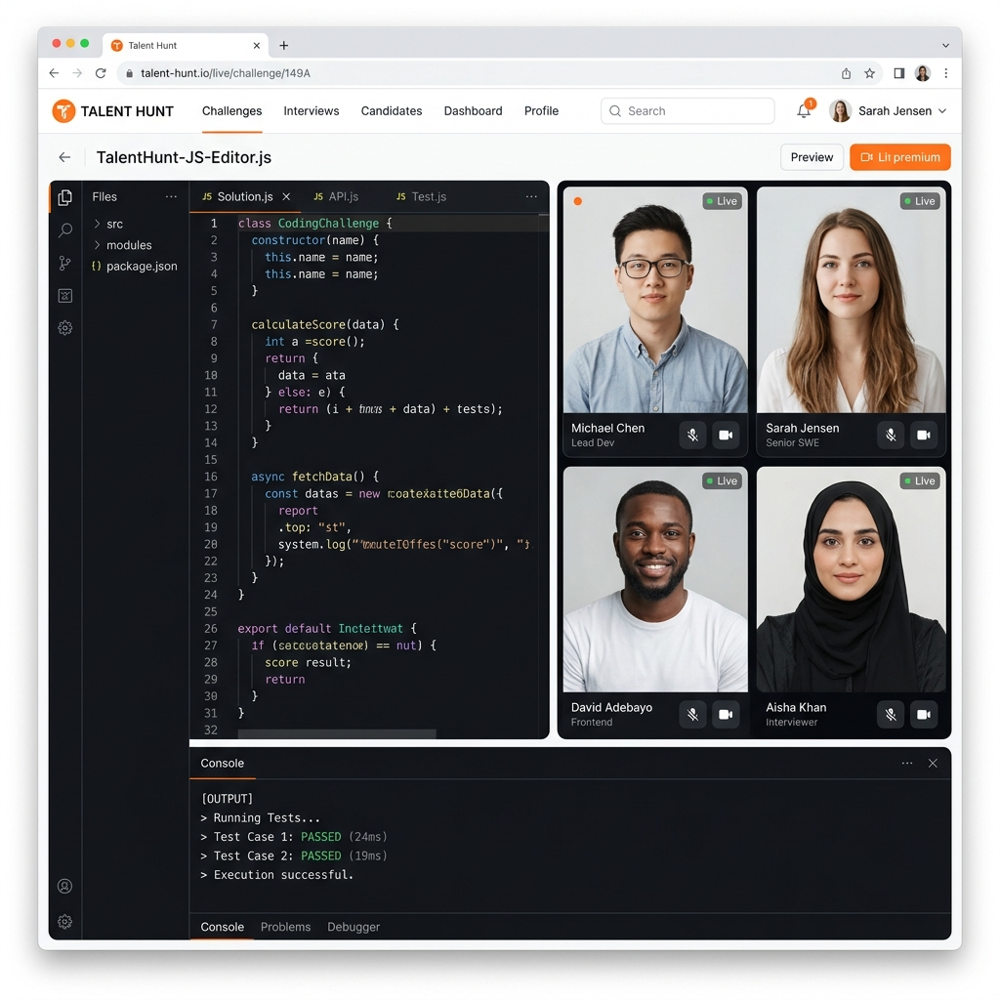
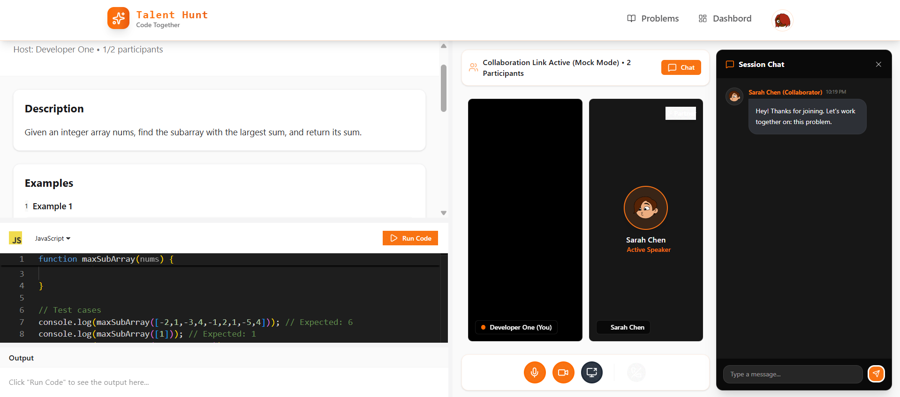
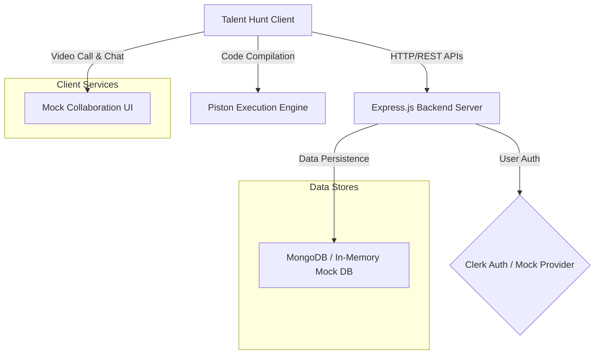

# 🎯 Talent Hunt - Real-Time Collaborative Pair Programming & Interview Platform

<p align="center">
  
  
  
  
  
</p>

Talent Hunt is a highly responsive, modern, and interactive full-stack web application designed for real-time collaborative coding sessions, coding interviews, and remote pair programming.

Featuring a unified **VSCode-powered Monaco code editor**, a fully isolated **code execution sandbox**, live **HD video calling**, real-time **interactive text chat**, and database persistence—all wrapped in a vibrant custom **white & orange theme**.

---

## 📸 Application Previews

### Collaborative Coding Session Dashboard
<p align="left">
  
</p>

### Landing Page & Welcome Screen
<p align="left">
  
</p>

---

## 🗺️ System Architecture

The following diagram illustrates how the frontend, backend server, in-memory/MongoDB database, code execution API, and communication frameworks interact seamlessly under Talent Hunt:



---

## ✨ Primary Features

- **🧑‍💻 Collaborative Code Editor**: Powered by Monaco Editor, supporting multiple programming languages, real-time sync, customizable layout resizing, and font formatting.
- **🎥 WebRTC-Based Video Call Grid**: Easily stream your local camera feed and share your screen directly in the collaboration room using native HTML5 media APIs.
- **💬 Live Messaging Chat**: Side-by-side session chat featuring dynamic message status, timestamps, and context-aware simulated replies from teammate Sarah Chen.
- **⚙️ Secure Sandbox Code Execution**: Powered by Piston API. Compile and run your code instantly, and view structured success/error stack traces.
- **🎯 Dynamic Code Validation**: Automatic test case checking on execution.
- **🎉 Premium Aesthetics**: A sleek off-white canvas with bright orange actions, custom hover state micro-animations, loading indicators, and success confetti celebrations.
- **🛡️ Zero-Dependency Local Startup**: Automatically activates **Mock Mode** if external credentials (Clerk, GetStream, MongoDB) are not set. The database falls back to an in-memory array database, and authentication falls back to a local username prompt.

---

## ⚡ Zero-Configuration Local Start

To run the application locally without creating any third-party developer accounts, simply launch it. Mock Mode will activate automatically!

### 1. Clone the Repository
```bash
git clone <your-github-repo-url>
cd talent-hunt
```

### 2. Set Up Environment Files
Create a `.env` file in the `backend` and `frontend` folders. If you leave them empty or use placeholder values, Mock Mode will automatically activate.

### 3. Run the Backend (`/backend`)
```bash
cd backend
npm install
npm run dev
```
*The server will start on `http://localhost:3000`. If MongoDB is not running locally, the server will switch to **In-Memory Database Mode** automatically within 2 seconds.*

### 4. Run the Frontend (`/frontend`)
```bash
cd frontend
npm install
npm run dev
```
*The client app will launch on `http://localhost:5173`.*

---

## 🧪 Production Environment Keys

To connect real services, define the following variables in your environment:

### Backend Configuration (`/backend/.env`)
```env
PORT=3000
NODE_ENV=development
CLIENT_URL=http://localhost:5173

# MongoDB Connection
DB_URL=mongodb+srv://<username>:<password>@cluster0.mongodb.net/talenthunt

# Clerk Authentication
CLERK_PUBLISHABLE_KEY=pk_test_...
CLERK_SECRET_KEY=sk_test_...

# GetStream Communication SDK
STREAM_API_KEY=your_stream_api_key
STREAM_API_SECRET=your_stream_api_secret

# Inngest Background Worker
INNGEST_EVENT_KEY=your_inngest_event_key
INNGEST_SIGNING_KEY=your_inngest_signing_key
```

### Frontend Configuration (`/frontend/.env`)
```env
VITE_API_URL=http://localhost:3000/api

# Auth & Video API Keys
VITE_CLERK_PUBLISHABLE_KEY=pk_test_...
VITE_STREAM_API_KEY=your_stream_api_key
```

---

## 🚀 Deployment & Scripts Summary

### Root Directory
- `npm run build`: Installs all dependencies across frontend and backend, and builds the production bundle for deployment.
- `npm start`: Starts the backend server.

### Backend (`/backend`)
- `npm run dev`: Runs the Node server locally with `nodemon` auto-reload.
- `npm start`: Runs the Node server in production.

### Frontend (`/frontend`)
- `npm run dev`: Boots the React/Vite development server.
- `npm run build`: Compiles optimized assets into the `dist/` directory.
- `npm run preview`: Locally previews production build output.
